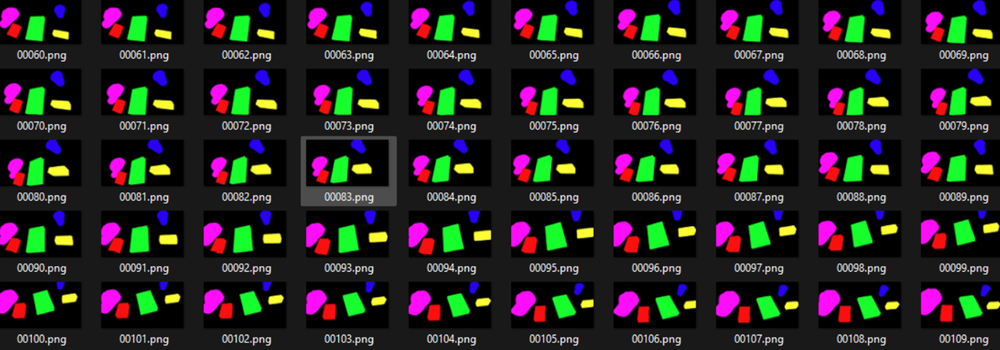
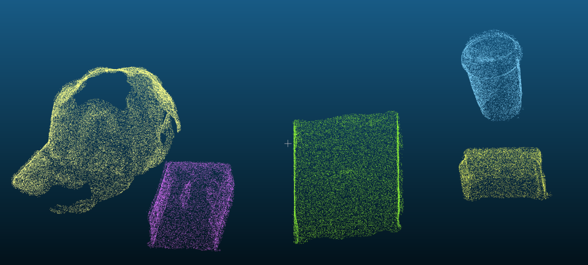
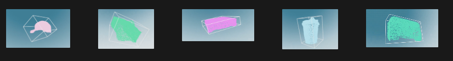
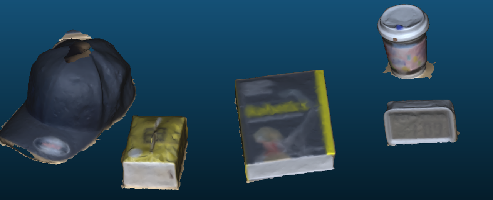
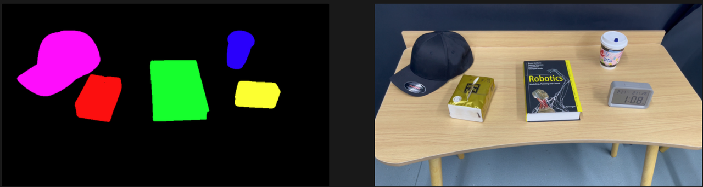

<div align="center">
  <h1 align="center">
    R2G: A Real2sim Pipeline For Realistic Visual And Physical Robotics Simulation With 3DGS
  </h1>

### [Project Page(coming soon)](TODO) | [Paper(coming soon)](TODO)

</div>

## Our Pipeline

TODO

1. Pose Estimation, 2D Segmentation
2. Dense Reconstruction, 3D Segmentation
3. Assist-GS Reconstruction, Scene Decomposition
4. LLM Label Annotations
5. Simulation

<!-- <div align="center">

</div> -->

## Environmental Setups

### Basic setup

```bash
## clone our code

git clone --recursive https://github.com/BigCiLeng/R2G.git

## create the env
conda create -n r2g python=3.10

## install the dependency
pip install -r ./requirements.txt
```

### Preprocessing tools

#### Assist-gs(Required)

Please install [assist-gs](https://github.com/BigCiLeng/assist-gs) following the guidance [here](https://github.com/BigCiLeng/assist-gs/blob/main/README.md) for decomposition GS modeling.

#### SAMpro3D(Required)

Please install [SAMpro3D](https://github.com/BigCiLeng/sampro3d) following the guidance [here](https://github.com/BigCiLeng/sampro3d/blob/main/installation.md) for zero-shot 3D segmentation.

#### Cutie(Required)

Please install [Cutie](https://github.com/hkchengrex/Cutie) following the guidance [here](https://github.com/hkchengrex/Cutie/blob/main/README.md) for video-segmentation.

#### OpenMVS(Optional)

Please install [OpenMVS-2.1.0](https://github.com/cdcseacave/openMVS) following the guidance [here](https://github.com/cdcseacave/openMVS/wiki/Building) for dense initlization of your datasets.

#### Colmap(Optional)

If you have GPS information in your image exif data, install [colmap](https://colmap.github.io/install.html) to use spatial_matching which utilizes GPS info.

#### Metashape(Optional)

You can use Metashap Professional Version 2.1.0 to replace Hloc and OpenMVS, we support both dense and sprase point cloud exporting for Metashape.

## Run the codes

### Data process

TODO

Example Dataset Format

```bash
<location>
├── align_matrix.txt
├── sparse_pc.ply
├── dense_pc.ply
├── transform_matrix.json
├── transforms.json
├── depth
│   ├── frame_00001.tif
│   └── frame_xxxxx.tif
├── images
│   ├── frame_00001.png
│   └── frame_xxxxx.png
└── sparse
    └── 0
        ├── cameras.bin
        ├── images.bin
        ├── points3D.bin
        └── points3D.ply
```

### Handcraft a 2D segmentation of the result you want

use the demo [efficientSAM](https://huggingface.co/spaces/microhan/efficientSAM_mask) implemented by [EfficientSAM: Leveraged Masked Image Pretraining for Efficient Segment Anything](https://github.com/yformer/EfficientSAM)

Example Result:

```bash
<location>
└── initial_mask
    ├── frame_00001.png
    └── frame_xxxxx.png
```

### video segmention

TODO

Example Result:


```bash
<location>
└── instance
    ├── frame_00001.png
    └── frame_xxxxx.png
```

### 3D Segmentation

TODO

Example Result:




```bash
<location>
├── align_matrix.txt
├── bboxs_aabb.npy
└── models
    ├── point_cloud
    │   ├── obj_00001.ply
    │   └── obj_xxxxx.ply
    └── mesh
        ├── obj_00001.ply
        └── obj_xxxxx.ply
```

### Assist-GS

TODO

Example Result:


```bash
<location>
└── models
    └── gaussians
        ├── obj_00001.ply
        └── obj_xxxxx.ply
```

### LLM Label Annotations

TODO

Example Result:

```json
// SINGLE Mask
 {
  "instance_id": "1",
  "label": {
    "name": "baseball cap",
    "color": "black",
    "description": "a black baseball cap with a curved brim and an adjustable strap in the back"
  },
  "physics": {
    "mass": "0.1",
    "collider": "mesh"
  }
}
// SCENE Mask
{
    {
        "instance_id": "1",
        "label": {
            "name": "book",
            "color": "red",
            "description": "a thick book titled Robotics with a multicolor cover"
        },
        "physics": {
            "mass": "1.5",
            "collider": "box"
        }
    },
    //...
}
```

```bash
<location>
└── models
    └── label
        ├── obj_00001.ply
        └── obj_xxxxx.ply
```

### Simutation

TODO

Example Result:

https://github.com/BigCiLeng/R2G/assets/59920768/855f76d6-4d90-46e2-b207-e86c8e51ff12

https://github.com/BigCiLeng/R2G/assets/59920768/3e11075c-8ddb-4249-8a6c-e56af150b4bc

## Prepare your own datasets

TODO

Please first put the images you want to use in a directory ```<location>/images```.

the final data format

```bash
<location>
├── align_matrix.txt
├── bboxs_aabb.npy
├── sparse_pc.ply
├── transform_matrix.json
├── transforms.json
├── depth
│   ├── frame_00001.tif
│   └── frame_xxxxx.tif
├── images
│   ├── frame_00001.png
│   └── frame_xxxxx.png
├── initial_mask
│   ├── frame_00001.png
│   └── frame_xxxxx.png
├── instance
│   ├── frame_00001.png
│   └── frame_xxxxx.png
├── models
│   ├── gaussians
│   │   ├── obj_00001.ply
│   │   └── obj_xxxxx.ply
│   ├── point_cloud
│   │   ├── obj_00001.ply
│   │   └── obj_xxxxx.ply
│   ├── label
│   │   ├── obj_00001.json
│   │   └── obj_xxxxx.json
│   └── mesh
│       ├── obj_00001.ply
│       └── obj_xxxxx.ply
└── sparse
    └── 0
        ├── cameras.bin
        ├── images.bin
        ├── points3D.bin
        └── points3D.ply
```
